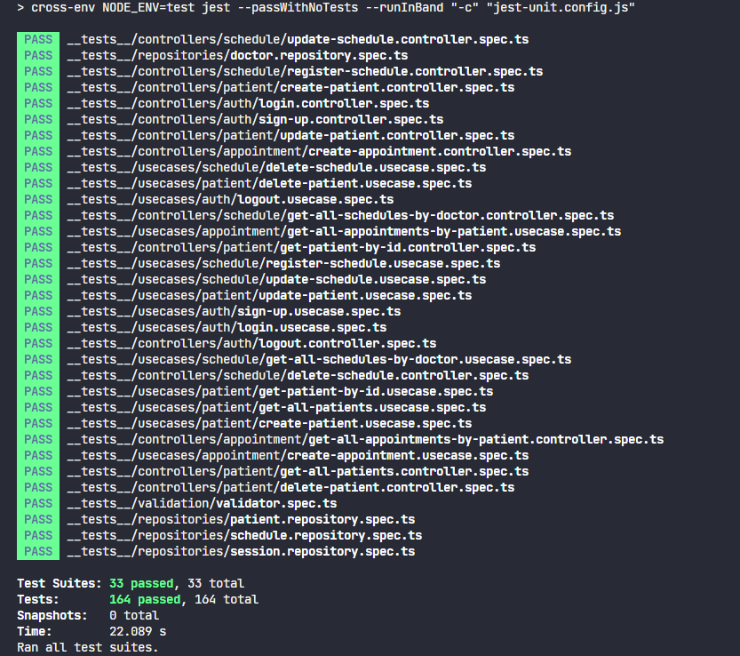
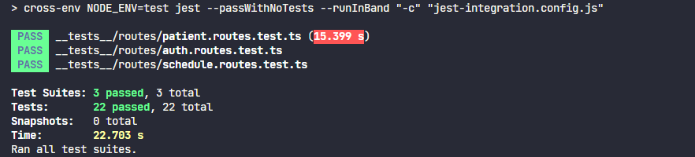
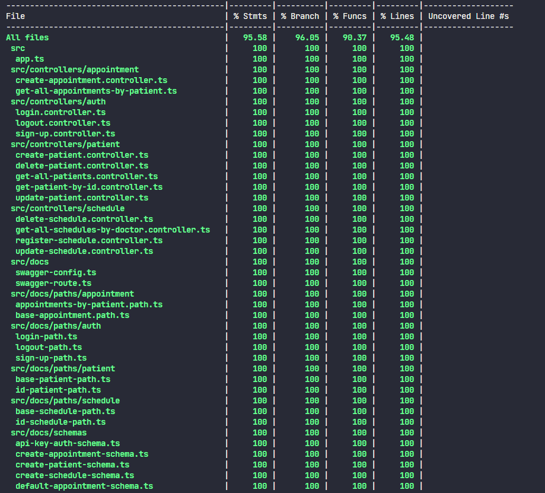
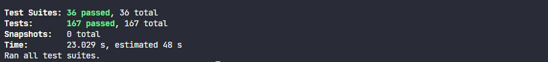
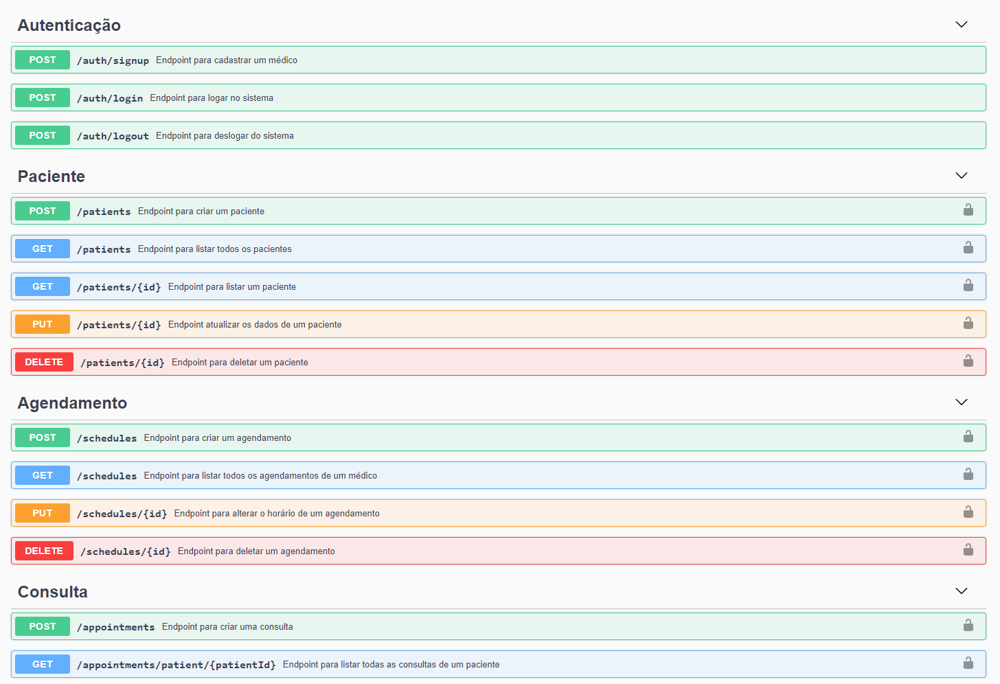
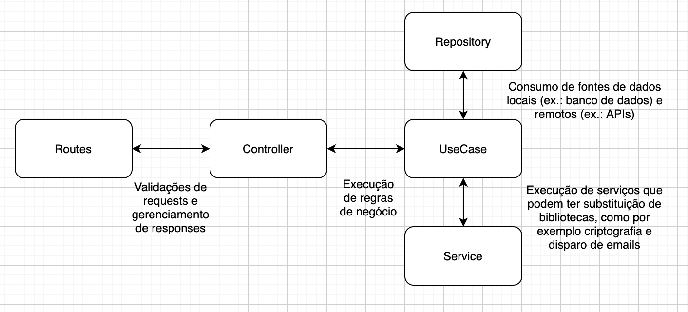
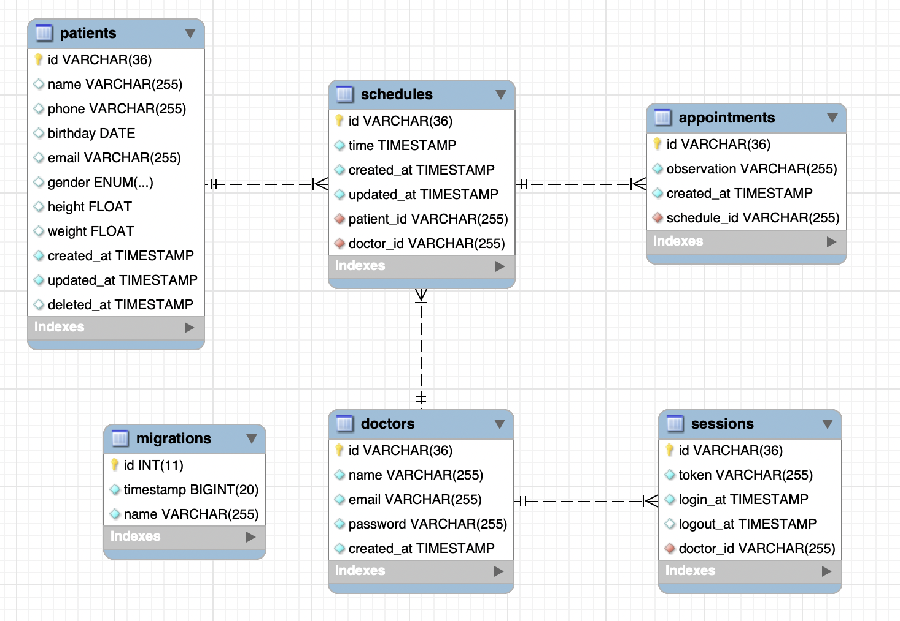

# PEBMED-CHALLENGE-API

API Restfull criada para o desafio da PEBMED.

- NodeJS
- MySQL
- Express
- TypeORM
- UUID
- JWT
- Bcrypt
- Jest
- Husky
- ESLint
- Swagger

# Setup

1. Instalar [Docker](https://docs.docker.com/engine/install/)
2. Instalar [Docker-Compose](https://docs.docker.com/compose/install/)
3. Conferir [arquivo de variaveis de ambiente](.env)
4. Rodar o comando `npm install` para baixar as dependências do projeto
5. Rodar o comando `npm run up` para subir o ambiente
6. Rodar o comando `npm run down` para parar o ambiente

> Em casos de problema com o MySQL, certifique-se que está com a versão mais recente do Docker e rode o comando `docker system prune -a -f --volumes`. **Atenção, esse comando irá apagar todas as imagens, containeres e volumes existentes**.

## Testes

Para rodar os testes certifique-se de possuir todas as dependências do projeto instaladas com o comando `npm install`

Os testes das pastas `__tests__/repositories` e `__tests__/routes` estão comentados porque tive dificuldades para conseguir utilizar o MySQL em memória para possibilitar os testes de integração e unitários somente na camada de repositório, mas para conseguir rodar esses tipos de testes, segue o exemplo utilizando um outro *schema*.

1. Criar o novo *schema* chamado **pebmed_test**. Certifique-se que o *container* do MySQL está rodando.
   ```
   docker-compose exec mysqldb mysql -u root -p -e "create database pebmed_test"
   ```
2. Remover comentários dos arquivos da pasta `__tests__/repositories`:
   1. `doctor.repository.spec.ts`
   2. `patient.repository.spec.ts`
   3. `schedule.repository.spec.ts`
   4. `session.repository.spec.ts`
3. Remover comentários dos arquivos da pasta `__tests__/routes`:
   1. `auth.routes.tests.ts`
   2. `patient.routes.tests.ts`

Para rodar somente os testes **unitários** rode o comando `npm run tests:unit`



Para rodar somente os testes de **integração** rode o comando `npm run tests:integration`



Para rodar todos os testes e obter o relatório de cobertura rode o comando `npm run tests:coverage`




## Documentação da API

Para ver a documentação da api certifique-se que está rodando a aplicação com o comando `npm run up` e acesse [localhost:3000/docs](http://localhost:3000/docs)



# Arquitetura



# Modelagem do banco de dados

